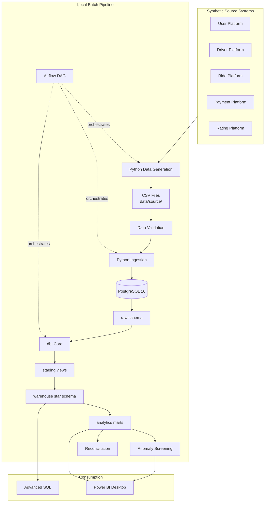

# RideFlow — Ride-Hailing Analytics Platform

**RideFlow** is a local, batch-oriented analytics platform that simulates a ride-hailing company (similar in concept to Uber/Careem) using **100% synthetic data**. It demonstrates end-to-end data engineering, dimensional modeling, analytics engineering, and BI preparation — without claiming cloud deployment, real-time streaming, or fraud detection.

---

## Project Overview

RideFlow ingests synthetic CSV exports from fictional source systems (user platform, driver platform, ride platform, payment platform, etc.), validates data quality, loads PostgreSQL, transforms with **dbt**, orchestrates with **Apache Airflow**, runs anomaly **screening**, and prepares **Power BI** dashboards.

| Attribute | Value |
|-----------|-------|
| Company | RideFlow (fictional) |
| Data | Synthetic only — no real PII or payments |
| Processing | Daily **batch** pipeline |
| Runtime | Local Docker + Python |
| Currency | RFU (RideFlow Units) |

---

## Business Problem

Ride-hailing operators need reliable answers to operational and strategic questions:

- How many rides complete vs cancel? What revenue is generated?
- Which cities, zones, and hours drive demand?
- How does surge pricing affect revenue, completion, and cancellations?
- Which drivers and customer segments are most valuable?
- Where does supply fall short of demand?
- Are there unusual ride patterns worth **reviewing** (not fraud verdicts)?

This platform builds the warehouse, marts, and BI layer to answer those questions from SQL and dashboards.

---

## Architecture



See [docs/architecture.md](docs/architecture.md) for detailed diagrams.

---

## Tech Stack

| Layer | Technology |
|-------|------------|
| Language | Python 3.11+ |
| Database | PostgreSQL 16 |
| Transformation | dbt Core |
| Orchestration | Apache Airflow (Docker) |
| BI | Power BI Desktop (spec + DAX docs) |
| ML (optional) | scikit-learn Isolation Forest |
| Infrastructure | Docker Compose |
| Testing | pytest |

**Not included:** Spark, Kafka, Snowflake, cloud services, real-time streaming.

---

## Dataset

Synthetic data is generated by `src/data_generation/` with configurable sizes via `.env`.

**Default (development-friendly):**

| Entity | Default Count |
|--------|---------------|
| Users | 10,000 |
| Drivers | 2,000 |
| Vehicles | 2,200 |
| Cities | 10 |
| Zones | 100 |
| Rides | 100,000 |
| Driver sessions | 50,000 |
| Promotions | 50 |

**Scale-up:** Set `NUM_USERS=100000`, `NUM_RIDES=3000000`, etc. in `.env` for production-style volumes.

**Cities (Pakistani-inspired, fictional analytics use):** Lahore, Karachi, Islamabad, Rawalpindi, Faisalabad, Multan, Peshawar, Gujranwala, Sialkot, Quetta.

A small **intentional DQ issue rate** (~0.2%) is injected to exercise validation.

---

## Data Model

PostgreSQL schemas: `raw`, `staging`, `warehouse`, `analytics`, `audit`, `monitoring`.

**Star schema** with dimensions (`dim_user`, `dim_driver`, `dim_vehicle`, `dim_city`, `dim_zone`, `dim_date`, `dim_time`, etc.) and facts (`fact_rides`, `fact_payments`, `fact_driver_sessions`, `fact_ratings`).

**`fact_rides` grain:** One row represents **one ride request/event**.

`dim_user` implements **SCD Type 2** scaffolding (`effective_date`, `expiration_date`, `is_current`).

Details: [docs/data_model.md](docs/data_model.md) | [docs/data_dictionary.md](docs/data_dictionary.md)

---

## Pipeline

End-to-end flow (also available as `make pipeline`):

```text
generate-data → validate → docker-up (Postgres) → ingest → dbt-build → anomaly-detection → reconcile
```

Airflow DAG `rideflow_daily_pipeline` orchestrates the same steps on a `@daily` schedule when running via Docker Compose.

Supports **full** and **incremental** loads with watermarks in `audit.pipeline_watermarks`. Ingestion is **idempotent** (dedupe + key-based delete/reload).

Details: [docs/pipeline.md](docs/pipeline.md)

---

## Data Quality

Pre-load validation (`src/validation/checks.py`) covers:

- Null checks on required fields
- Uniqueness of natural keys
- Referential integrity (rides → users, drivers, vehicles)
- Numeric ranges (distance, duration, fare, surge, ratings)
- Timestamp sequence for completed rides
- Fare reconciliation against documented pricing formula

Results saved to `data/processed/dq_results.json`. dbt tests run on staging models.

Details: [docs/data_quality.md](docs/data_quality.md)

---

## Analytics

**14 dbt analytics marts** including daily/monthly ride metrics, city/zone performance, user activity, driver performance, surge analysis, supply-demand, cancellation analysis, cohort retention, and anomaly monitoring.

**30+ advanced SQL queries** in `sql/analytics/` demonstrating JOINs, CTEs, window functions, cohort analysis, and ranking.

KPI definitions: [docs/metrics.md](docs/metrics.md)

---

## Anomaly Detection

Rule-based flags, customer-level **z-score** screening, and optional **Isolation Forest** identify **potential anomalies for review**.

> This is analytical screening — **not fraud confirmation**.

Results stored in `monitoring.ride_anomalies`.

Details: [docs/anomaly_detection.md](docs/anomaly_detection.md)

---

## Power BI

Dashboard specification and DAX measures are documented (not a bundled `.pbix`):

- [dashboards/powerbi/dashboard_spec.md](dashboards/powerbi/dashboard_spec.md) — 9 pages (Executive, Rides, Customer, Driver, Geo, Surge, Cancellation, Anomaly, DQ)
- [dashboards/powerbi/dax_measures.md](dashboards/powerbi/dax_measures.md) — measure definitions

**Interactive dashboard (connected to warehouse):** open [`dashboards/rideflow_bi_dashboard.html`](dashboards/rideflow_bi_dashboard.html) or run `make dashboard`.

**Live on Vercel:** the BI dashboard is deployed from `public/` (see project README deploy section).

Power BI Desktop can also connect to PostgreSQL (`warehouse` + `analytics`) — see [`dashboards/powerbi/CONNECT.md`](dashboards/powerbi/CONNECT.md).

---

## How to Run

### Prerequisites

- Python 3.11+
- PostgreSQL via **Docker Compose** *or* the bundled **pgserver** local runner (no Docker required)
- Make (optional)

### Quick start (no Docker)

```bash
python -m pip install -r requirements.txt
copy .env.example .env   # Windows
python scripts/run_local_postgres_pipeline.py
python -m pytest tests -v
```

Or: `make pipeline-local` then `make test`.

### Quick start (Docker)

```bash
make setup
make pipeline
make test
```

### Individual commands

| Command | Description |
|---------|-------------|
| `make generate-sample` | Small sample dataset |
| `make generate-data` | Full configured dataset (see `.env`) |
| `make validate` | Run DQ checks on CSVs |
| `make pipeline-local` | End-to-end on embedded PostgreSQL |
| `make docker-up` | Start Postgres + init schemas |
| `make ingest` | Full load to raw |
| `make ingest-incremental` | Incremental load |
| `make dbt-build` | dbt run |
| `make anomaly-detection` | Anomaly screening |
| `make reconcile` | Source vs warehouse reconciliation |
| `make insights` | Refresh `analysis/business_insights.md` from SQL |
| `make clean` | Remove generated artifacts |

Scale dataset sizes with `NUM_USERS`, `NUM_RIDES`, etc. in `.env`. Defaults are development-friendly; full résumé-scale targets are documented in `.env.example`.

### Airflow (optional, requires Docker)

```bash
docker compose up -d
# Web UI: http://localhost:8080 (admin / admin)
# Trigger DAG: rideflow_daily_pipeline
```

---

## Testing

```bash
make test
# or: python -m pytest tests -v
```

Tests cover data generation, validation, pricing, idempotency, and anomaly detection logic.

---

## Example SQL

Core KPIs from `warehouse.fact_rides`:

```sql
SELECT
    COUNT(*) AS total_rides,
    COUNT(*) FILTER (WHERE is_completed) AS completed_rides,
    ROUND(100.0 * COUNT(*) FILTER (WHERE is_completed) / NULLIF(COUNT(*), 0), 2) AS completion_rate,
    ROUND(SUM(total_fare) FILTER (WHERE is_completed)::NUMERIC, 2) AS total_revenue
FROM warehouse.fact_rides;
```

More queries: `sql/analytics/01_core_kpis.sql` through `05_advanced_patterns.sql`.

---

## Business Insights

Insights must be **generated from the actual database** — not invented in documentation.

After running the pipeline:

```bash
python scripts/generate_insights.py
```

See [analysis/business_insights.md](analysis/business_insights.md) for the question template.

---

## Screenshots

Power BI screenshots belong in `dashboards/screenshots/` after you build the dashboard locally. Placeholder directory is included; add PNG exports after connecting to your Postgres instance.

---

## Future Improvements

- Scale default dataset to 3M+ rides for performance benchmarking
- Full SCD Type 2 incremental merges for user history on city/type changes
- Persist DQ results to `audit.data_quality_results` during pipeline runs
- Partition `fact_rides` by month at very large scale
- CI pipeline (GitHub Actions) for pytest + dbt
- Optional `.pbix` template export

Cloud migration concepts: [docs/cloud_architecture.md](docs/cloud_architecture.md)

---

## Documentation Index

| Document | Description |
|----------|-------------|
| [docs/architecture.md](docs/architecture.md) | Mermaid diagrams |
| [docs/data_model.md](docs/data_model.md) | Star schema & grain |
| [docs/data_dictionary.md](docs/data_dictionary.md) | Column-level reference |
| [docs/metrics.md](docs/metrics.md) | KPI formulas |
| [docs/pipeline.md](docs/pipeline.md) | Incremental & idempotency |
| [docs/data_quality.md](docs/data_quality.md) | Checks & intentional issues |
| [docs/reconciliation.md](docs/reconciliation.md) | Metric reconciliation |
| [docs/anomaly_detection.md](docs/anomaly_detection.md) | Screening methodology |
| [docs/performance.md](docs/performance.md) | Indexes & optimization |
| [docs/interview_guide.md](docs/interview_guide.md) | Q&A for interviews |
| [docs/cloud_architecture.md](docs/cloud_architecture.md) | Conceptual cloud paths |
| [docs/final_report.md](docs/final_report.md) | Comprehensive project report |

---

## License

See [LICENSE](LICENSE).
