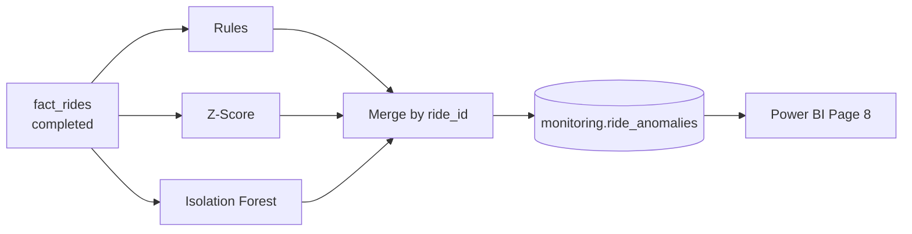

# RideFlow Anomaly Detection

RideFlow includes an **analytical screening system** for unusual ride patterns. It flags rides that may warrant human review.

> **This is NOT fraud detection.** Flagged records are *potential anomalies* — not confirmed fraud, abuse, or policy violations.

---

## Design Philosophy

| Principle | Implementation |
|-----------|----------------|
| Screening, not verdict | Language: "potential anomaly", "ride requiring review" |
| Explainability | `anomaly_reason` text on every flag |
| Configurable thresholds | `ANOMALY_ZSCORE_THRESHOLD` env var |
| Optional ML | Isolation Forest toggle via `ANOMALY_ISOLATION_FOREST` |
| Idempotent runs | Truncate + reload `monitoring.ride_anomalies` each run |

Location: `src/anomaly_detection/detect.py`  
Command: `make anomaly-detection`

---

## Data Source

Primary: `warehouse.fact_rides` (completed rides only)  
Fallback: `raw.rides` if warehouse unavailable

---

## Detection Methods

### 1. Rule-Based Flags

Business rules compared against distribution percentiles:

| Rule | Condition | Severity contribution |
|------|-----------|----------------------|
| Extremely high fare | fare > P99 × 1.2 | +2.0 |
| Extremely long ride | distance > P99 | +1.5 |
| Extremely short ride | distance < max(0.3, P01) | +1.0 |
| Long duration | duration > P99 | +1.0 |
| Rapid repeat rides | Same user, < 5 min since previous | +2.0 |
| Late-night high value | Hour 1–3 AM + fare > P99 | +1.5 |

Severity mapping from cumulative score:

| Score | Severity |
|-------|----------|
| ≥ 5.0 | Critical |
| ≥ 3.5 | High |
| ≥ 2.0 | Medium |
| < 2.0 | Low |

### 2. Statistical (Z-Score)

Per customer (minimum 5 rides):

```text
z_score = (fare − customer_mean) / customer_std
```

Flag when: `|z_score| ≥ ANOMALY_ZSCORE_THRESHOLD` (default 3.0)

Severity: Medium or High based on magnitude.

### 3. Isolation Forest (Optional)

When `ANOMALY_ISOLATION_FOREST=true` and ≥ 100 completed rides:

**Features:**
- fare, distance_km, duration_minutes, surge_multiplier
- hour_of_day, rides_last_1_hour, fare_vs_user_average

Model: `IsolationForest(n_estimators=100, contamination=0.01)`

Output: `ml_anomaly_score` (higher = more anomalous)  
Reason: `"Isolation Forest unusual pattern (screening only)"`

---

## Merge Logic

1. Run all enabled detectors
2. Concatenate results
3. **Keep highest severity per ride_id** (dedupe)
4. Truncate `monitoring.ride_anomalies`
5. Insert merged flags

---

## Output Table

`monitoring.ride_anomalies`:

| Column | Description |
|--------|-------------|
| anomaly_id | Serial PK |
| ride_id | Flagged ride |
| user_id, driver_id | Context |
| timestamp | Ride request time |
| fare | Fare at detection |
| rule_based_score | Rule engine score |
| ml_anomaly_score | IF score (nullable) |
| anomaly_reason | Human-readable explanation |
| severity | Low / Medium / High / Critical |
| detected_at | Run timestamp |

Analytics mart: `analytics.mart_anomaly_monitoring`

---

## Flow Diagram



---

## Power BI Presentation

Page 8 must include disclaimer:

> **Analytical anomaly monitoring — not fraud confirmation.**

Show: count by severity, reasons, city, time trend, user history drill-through.

DAX: `Anomaly Count`, `Anomaly Rate` (see `dax_measures.md`).

---

## False Positives

Expected and acceptable for screening:

- Legitimate long airport rides flagged as "extremely long"
- Premium users with naturally high fares flagged by z-score
- Isolation Forest may flag rare but valid multi-stop patterns

**Human review** is the intended next step — not automated blocking.

---

## What This System Does NOT Do

- Real-time blocking of rides or payments
- Identity verification or device fingerprinting
- Network/graph fraud analysis
- Integration with payment processor dispute systems
- Legal or compliance fraud adjudication

---

## Configuration

```env
ANOMALY_ZSCORE_THRESHOLD=3.0
ANOMALY_ISOLATION_FOREST=true
```

Adjust threshold upward to reduce sensitivity.

---

## Testing

`tests/test_pricing_and_anomaly.py` validates detection logic against known patterns.
