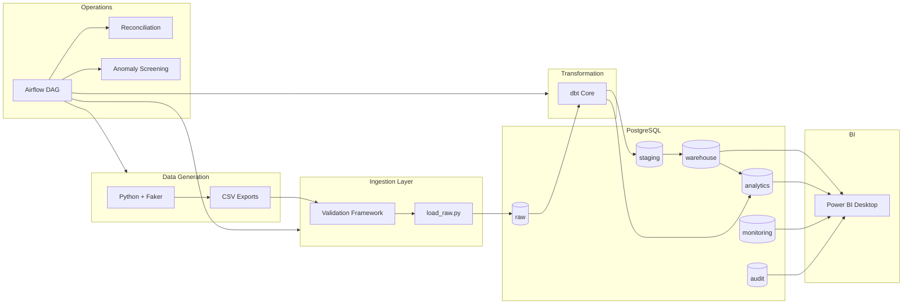
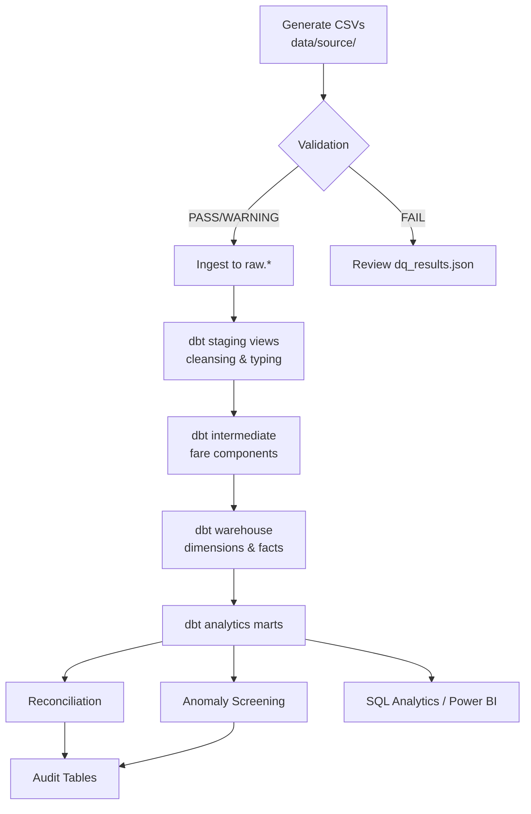
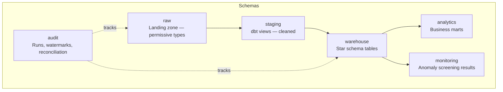
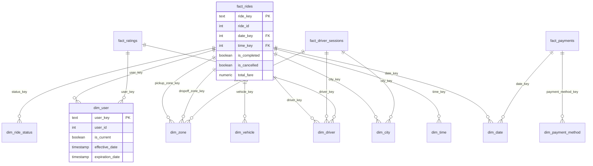
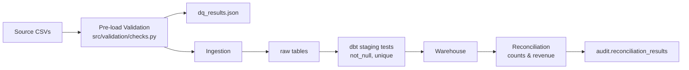
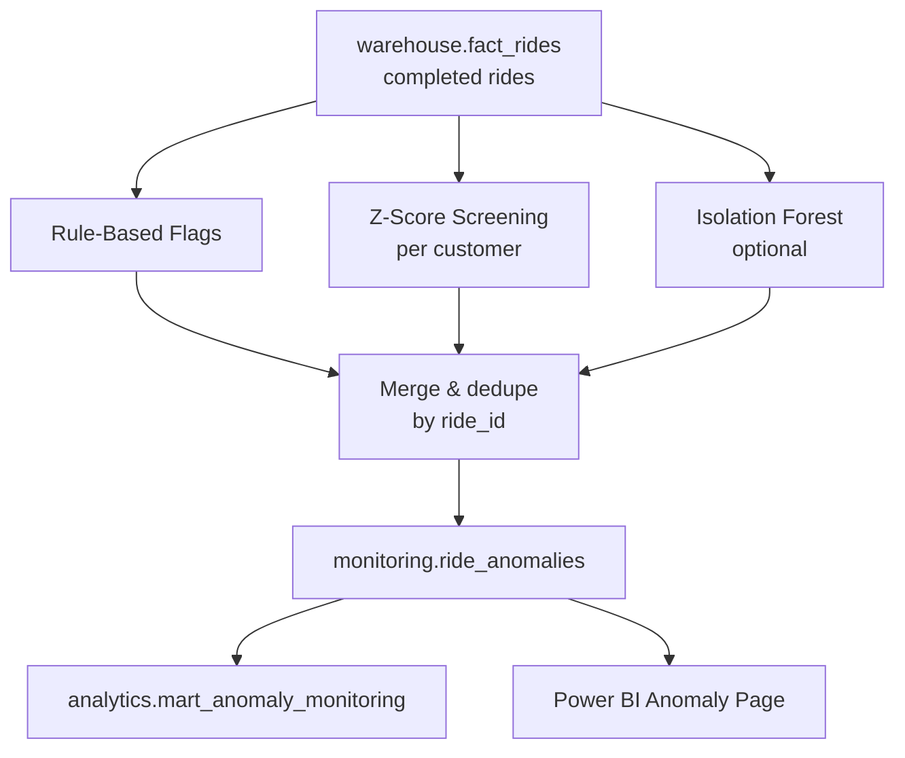

# RideFlow Architecture

This document describes the **local batch architecture** of the RideFlow Analytics Platform. All processing runs on a developer machine via Python, PostgreSQL (Docker), dbt, and Airflow — not in a cloud environment.

---

## Overall Architecture



---

## ETL Pipeline

RideFlow uses an **ELT** pattern: load raw data first, transform in-database with dbt.



**Batch boundaries:** Each run receives a unique `batch_id`. Full mode truncates raw tables; incremental mode filters by watermark timestamps and upserts by natural key.

---

## Database Architecture



| Schema | Purpose |
|--------|---------|
| `raw` | CSV landing with ingestion metadata |
| `staging` | Typed, standardized views |
| `warehouse` | Conformed dimensions + facts |
| `analytics` | Aggregated marts for BI |
| `audit` | Pipeline runs, watermarks, reconciliation |
| `monitoring` | Potential anomaly flags |

DDL: `sql/ddl/01_schemas.sql`, `02_raw_tables.sql`, `03_audit_monitoring.sql`

---

## Star Schema



**Fact grain:** `fact_rides` = one row per ride request/event.

---

## Airflow DAG

DAG ID: `rideflow_daily_pipeline`  
Schedule: `@daily` (batch, not streaming)

```mermaid
flowchart TD
    start([start]) --> check_sources[check_sources]
    check_sources --> generate[generate_or_receive_data]
    generate --> iu[ingest_users]
    generate --> id[ingest_drivers]
    generate --> iv[ingest_vehicles]
    generate --> ir[ingest_rides]
    generate --> ip[ingest_payments]
    generate --> irt[ingest_ratings]
    iu & id & iv & ir & ip & irt --> validate[validate_data]
    validate --> load_raw[load_raw]
    load_raw --> dbt_stg[dbt_staging]
    dbt_stg --> dbt_wh[dbt_warehouse]
    dbt_wh --> dbt_an[dbt_analytics]
    dbt_an --> recon[reconciliation]
    recon --> anomaly[anomaly_detection]
    anomaly --> dq_test[data_quality_tests]
    dq_test --> audit[update_audit]
    audit --> end([end])
```

Per-entity ingest tasks are placeholders; actual loading occurs in `load_raw`. Retries: 2, delay: 3 minutes.

---

## Data Quality Flow



Validation runs **before** ingestion in the Makefile pipeline. Intentional source issues are injected at ~0.2% rate for realism.

---

## Anomaly Detection Flow



**Important:** Outputs are labeled *potential anomalies* for operational review — not fraud determinations.

---

## Deployment Topology (Local)

```text
Host Machine
├── Python venv (generation, ingestion, validation, anomaly, reconcile)
├── Docker Compose
│   ├── postgres:5432 (rideflow DB + airflow DB)
│   ├── airflow-webserver:8080
│   └── airflow-scheduler
└── Power BI Desktop → connects to localhost:5432
```

No Kubernetes, no managed cloud warehouse in the default setup.
