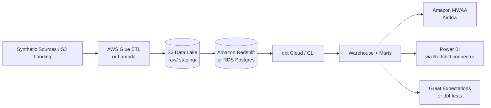
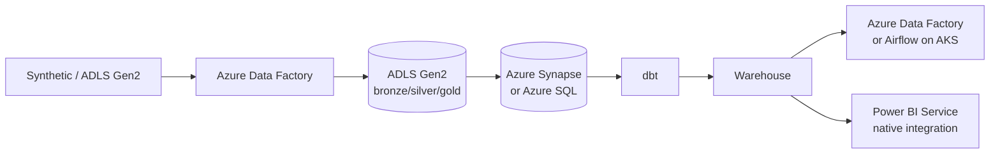
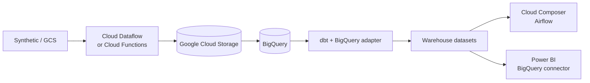

# RideFlow Cloud Architecture (Conceptual)

This document describes **how the local RideFlow platform could migrate to cloud** — conceptual only. The default project runs entirely on your machine with Docker; **no cloud deployment is required or included**.

---

## Current State (Local)

```text
Python (generation, ingest, validation)
    ↓
CSV files (data/source/)
    ↓
PostgreSQL 16 (Docker)
    ↓
dbt Core (CLI)
    ↓
Airflow (Docker, LocalExecutor)
    ↓
Power BI Desktop → localhost:5432
```

---

## AWS Migration Path



| Local Component | AWS Equivalent |
|-----------------|----------------|
| CSV files | S3 buckets (partitioned by date/entity) |
| Python ingest | Glue jobs, Lambda, or ECS tasks |
| PostgreSQL | RDS PostgreSQL or Redshift |
| dbt | dbt Cloud or CI runner |
| Airflow Docker | Amazon MWAA |
| Validation | Glue Data Quality, Great Expectations |
| Anomaly screening | SageMaker batch or ECS Python job |
| Secrets | AWS Secrets Manager |
| Audit logs | CloudWatch + RDS tables |

**Note:** Redshift requires minor SQL dialect adjustments; Postgres-compatible path (RDS) minimizes dbt changes.

---

## Azure Migration Path



| Local Component | Azure Equivalent |
|-----------------|------------------|
| CSV files | ADLS Gen2 (bronze layer) |
| Python ingest | ADF Mapping Data Flows or Azure Functions |
| PostgreSQL | Azure Database for PostgreSQL or Synapse dedicated pool |
| dbt | dbt Cloud / Azure DevOps pipeline |
| Airflow | Self-hosted on AKS or ADF orchestration |
| Power BI | Power BI Service with DirectQuery/Import |
| Key Vault | Connection strings, credentials |

Azure offers the smoothest Power BI integration path.

---

## GCP Migration Path



| Local Component | GCP Equivalent |
|-----------------|------------------|
| CSV files | GCS buckets |
| Python ingest | Dataflow (Apache Beam) or Cloud Run jobs |
| PostgreSQL | BigQuery (recommended) or Cloud SQL Postgres |
| dbt | dbt-bigquery |
| Airflow | Cloud Composer |
| Anomaly ML | Vertex AI batch prediction |
| Monitoring | Cloud Logging + BigQuery audit tables |

BigQuery partitioning/clustering replaces Postgres index strategy at scale.

---

## Cross-Cutting Migration Considerations

### What transfers directly

- dbt model logic (with adapter-specific tweaks)
- Star schema design and grain definitions
- KPI formulas and metric definitions
- Airflow DAG structure (task graph)
- DQ check concepts and reconciliation patterns
- Anomaly screening logic (Python portable to any compute)

### What changes

| Aspect | Change |
|--------|--------|
| Connection strings | Cloud-managed endpoints |
| Incremental strategy | S3/GCS partition markers vs Postgres watermarks |
| Secrets | Never in .env committed — use vault services |
| Orchestration executor | LocalExecutor → Celery/Kubernetes/ managed |
| BI connectivity | Desktop localhost → Service cloud gateway |
| Cost model | Pay-per-query (BigQuery) vs fixed instance (RDS) |

### What NOT to migrate blindly

- Local Docker Compose as production topology
- Truncate-reload full mode on large tables (use merge/upsert)
- pandas row iteration for anomaly at millions of rows
- Fabricated performance benchmarks

---

## Recommended Migration Phases

1. **Lift data** — Move CSV generation output to object storage
2. **Lift warehouse** — Cloud Postgres or native warehouse (Redshift/BQ/Synapse)
3. **Port dbt** — Switch adapter, run `dbt build` in CI
4. **Orchestrate** — Deploy DAG to managed Airflow
5. **Connect BI** — Power BI Service with scheduled refresh
6. **Harden** — IAM, encryption, backup, monitoring alerts

---

## Cost Awareness

This project intentionally avoids requiring paid cloud services for learning. When migrating:

- Use free tiers / sandbox accounts for demos
- Start with RDS Postgres (minimal dbt changes) before jumping to Redshift/BQ
- Schedule batch jobs; avoid always-on clusters for dev

---

## Summary

RideFlow's architecture maps cleanly to any major cloud's **lakehouse + warehouse + orchestration + BI** pattern. The local implementation proves the data model and pipeline logic; cloud migration is an infrastructure swap, not a redesign of the star schema or analytics semantics.
