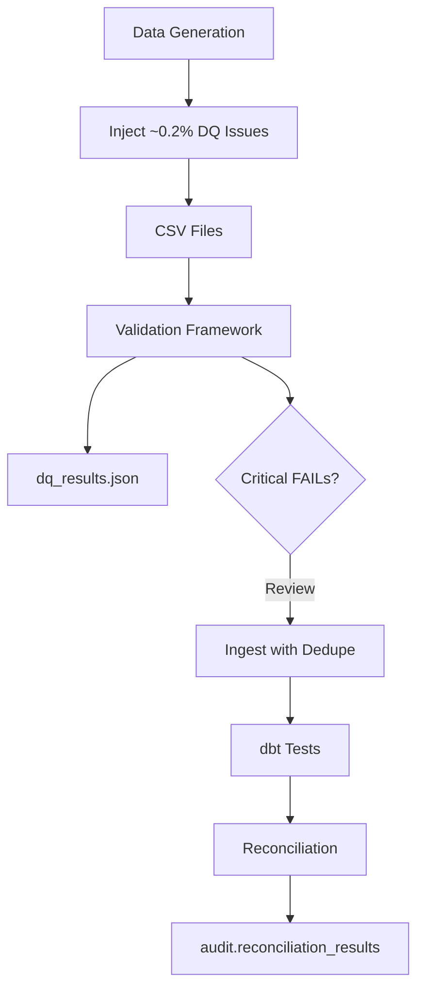

# RideFlow Data Quality

RideFlow implements a **pre-load validation framework** plus **dbt tests** and **reconciliation** to detect issues in synthetic source data — including intentionally injected problems.

---

## Validation Framework

Location: `src/validation/checks.py`  
Entry point: `make validate` → `data/processed/dq_results.json`

Each check returns: `check_name`, `table_name`, `status` (PASS/WARNING/FAIL), `expected`, `actual`, `message`.

---

## Check Categories

### Null Checks

Required non-null fields:

| Table | Columns |
|-------|---------|
| users | user_id, registration_date, city_id, user_type, status |
| drivers | driver_id, registration_date, city_id, status, rating |
| vehicles | vehicle_id, driver_id, vehicle_type, status |
| rides | ride_id, user_id, city_id, request_timestamp, ride_status |
| payments | payment_id, ride_id, user_id, amount, payment_status |

### Uniqueness

Natural keys must be unique in source CSVs:

- `user_id`, `driver_id`, `vehicle_id`, `ride_id`, `payment_id`

Duplicates (intentionally injected) should produce **FAIL**.

### Referential Integrity

| Check | Rule |
|-------|------|
| fk_ride_user | Every ride.user_id exists in users |
| fk_ride_driver | Non-null driver_id must exist in drivers |
| fk_ride_vehicle | Non-null vehicle_id must exist in vehicles |

Null driver_id is allowed for `Requested` / `No_Driver_Available` statuses.

### Numeric Validation

| Check | Rule |
|-------|------|
| distance_positive | Completed rides: distance_km > 0 |
| duration_positive | Completed rides: duration_minutes > 0 |
| fare_non_negative | total_fare ≥ 0 |
| surge_gte_1 | surge_multiplier ≥ 1 |
| rating_range | rating BETWEEN 1 AND 5 |

### Timestamp Validation

For completed rides, timestamps must be monotonic:

```text
request_timestamp ≤ accepted_timestamp ≤ pickup_timestamp ≤ dropoff_timestamp
```

### Fare Reconciliation

Recomputes fare using `config/pricing.calculate_fare()` and compares to `total_fare`.

Tolerance: `FARE_TOLERANCE` (default 0.05 RFU).

| Result | Condition |
|--------|-----------|
| PASS | 0 mismatches |
| WARNING | < 1% mismatches |
| FAIL | ≥ 1% mismatches |

### Status Validation

| Domain | Valid values |
|--------|--------------|
| ride_status | Requested, Accepted, Driver_Cancelled, Rider_Cancelled, Completed, No_Driver_Available |
| payment_status | Completed, Failed, Refunded, Pending |

---

## Intentional Data Quality Issues

Injected by `src/data_generation/dq_issues.py` at rate `DQ_ISSUE_RATE` (default 0.002).

| Issue | Purpose |
|-------|---------|
| Duplicate users | Test uniqueness detection |
| Duplicate rides | Test dedupe on ingest |
| Duplicate payments | Test payment integrity |
| Missing driver_id | Nullable FK edge case |
| Missing pickup_zone_id | Null dimension handling |
| Status `completED` | Capitalization inconsistency |
| Status `Flying` | Invalid enum value |
| Negative discount_amount | Numeric validation |
| Zero distance_km | Distance check |
| Negative duration_minutes | Duration check |
| Swapped timestamps | Sequence validation |
| Inflated total_fare (×1.5) | Fare reconciliation |
| Invalid user_id (99999999) | Referential integrity |
| payment_status `Unknown` | Invalid payment status |

These issues are **small by design** (~0.2%) so the pipeline remains usable while validation demonstrates real DQ patterns.

---

## dbt Tests

`dbt/models/staging/schema.yml`:

| Model | Tests |
|-------|-------|
| stg_users | user_id: not_null, unique |
| stg_drivers | driver_id: not_null, unique |
| stg_vehicles | vehicle_id: not_null, unique |
| stg_rides | ride_id: not_null |

Run: `dbt test --profiles-dir .` (included in `dbt build`).

---

## Ingestion DQ Handling

`load_raw.py`:
- Deduplicates by natural key before load (`keep='last'`)
- Does not silently fix invalid statuses — staging/dbt normalizes where possible
- Full reload clears prior bad rows; incremental upserts replace by key

---

## Reconciliation (Post-Transform)

Separate from pre-load validation — compares raw vs warehouse metrics. See [reconciliation.md](reconciliation.md).

---

## Data Quality Flow



---

## Operational Response

| Status | Action |
|--------|--------|
| PASS | Proceed to ingest |
| WARNING | Review message; may proceed for demo data |
| FAIL | Investigate source; fix generator or filter before production use |

For Power BI Page 9 (Data Quality), connect to `audit.reconciliation_results` and import `dq_results.json` or future `audit.data_quality_results` persistence.

---

## What We Do NOT Claim

- Automated remediation of all bad records
- 100% clean synthetic data (issues are intentional)
- Real-time DQ streaming alerts
